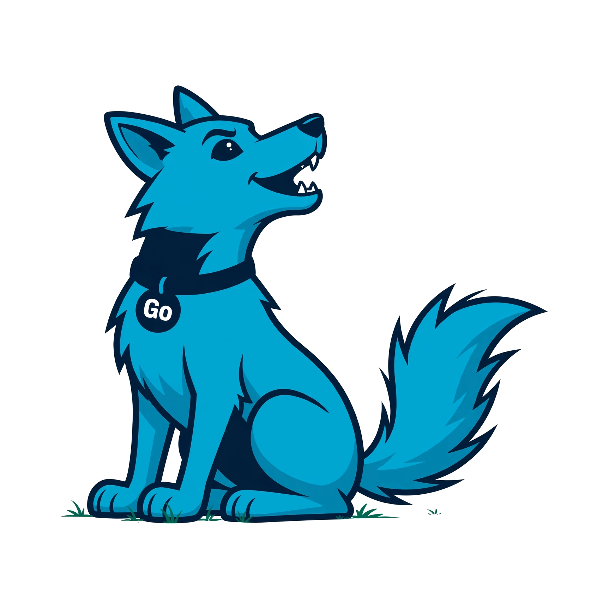

<p align="center">
  
</p>

<h1 align="center">coyote</h1>

<p align="center">
  A full-stack web framework for Go. Server-rendered, session-first, and built on the standard library.
</p>

---

Routing, sessions, authentication, templates, middleware, and the admin portal are pure standard
library. Persistence uses GORM with a cgo-free SQLite driver, so `go get` is the whole install and
`CGO_ENABLED=0` still builds a static binary.

Configuration is explicit: every project declares a `settings.go`, and the app refuses to start
without one. Settings are validated before the server listens, so an unsafe production config fails
at startup instead of at 3am.

```go
func main() {
	a := app.New()

	admin.Mount(a)

	a.Get("/{$}", func(w http.ResponseWriter, r *http.Request) {
		a.Render(w, r, "pages/home.html", app.Data{"Title": "Home"})
	}).Named("home")

	log.Fatal(a.Run())
}
```

## What comes with it

- **Admin portal** — login, dashboard, user management, session revoke. Register a model and it
  grows a full CRUD section with no routes, handlers, or templates from you.
- **Sessions** — three backends: in the database by default, in memory, or sealed in the cookie with
  AES-GCM.
- **Authentication** — a user entity, PBKDF2 passwords, sign-in, route guards, pluggable password
  rules, and login throttling on by default.
- **Permissions** — four permissions per model, bundled into roles, managed from the portal.
- **Forms and uploads** — struct or schema binding with validation, and file uploads that stage,
  sniff, and clean up after themselves.
- **Migrations** — versioned, written in Go rather than SQL, checksummed so an edited migration is
  caught rather than silently skipped, applied in a transaction wherever the engine has one, and
  behind an advisory lock so two deploying instances cannot race.
- **Security on by default** — CSRF on every route, login throttling, allowed hosts, secure headers,
  a request body cap, and a session cookie that a deployed environment refuses to send in clear.
  **Opt in** to CSP with per-request nonces, rate limiting, CORS, gzip, HSTS and Let's Encrypt
  certificates: each is one setting, and validation tells you when a combination is unsafe.
- **Caching** — one interface over memory, disk or Redis, with `Remember`, template fragments, whole
  pages and query results. The Redis client is standard library, so it costs no dependency.
- **Internationalisation** — gettext catalogs, plural rules read from each translator's own file,
  locale detection, and an admin portal that is already translated and right-to-left correct.
- **Background jobs** — a queue in your own database, so a job commits in the same transaction as the
  data it is about. Retries with backoff, a dead-letter state you can retry from the portal, interval
  scheduling, and workers either in the web process or as `coyote worker`. No broker, no dependency.
- **One CLI** — `makemigrations`, `migrate`, `createsuperadmin`, `start`, `worker`, pinned to your
  project as a Go tool.

## Install

```
go install github.com/farhapartex/coyote/cmd/coyote@latest

coyote new myshop
cd myshop
coyote start
```

`new` scaffolds a project that already builds — settings, routes, a layout, a generated `SecretKey`
in a git-ignored `.env` — then pulls the framework and tidies. Nothing to clone.

Requires Go 1.25 or newer. GORM and the SQLite driver come with it; there is nothing else to
install.

## Documentation

Start with the [quick start](guide/02-quickstart.md), or browse the full
[documentation contents](guide/README.md).

| | | |
| --- | --- | --- |
| **Getting started** | [Installation](guide/01-installation.md) · [Quick start](guide/02-quickstart.md) · [Project layout](guide/03-project-layout.md) | |
| **Configuration** | [Settings](guide/04-settings.md) | |
| **Requests** | [Routing](guide/05-routing.md) · [Named routes](guide/06-named-routes.md) · [Views](guide/07-views.md) · [Templates](guide/08-templates.md) · [Static files](guide/09-static-files.md) · [Forms](guide/30-forms.md) · [Uploads](guide/31-uploads.md) · [Pagination](guide/32-pagination.md) | |
| **Data** | [Models](guide/10-models.md) · [Database](guide/11-database.md) · [Migrations](guide/12-migrations.md) · [Caching](guide/33-caching.md) · [Internationalisation](guide/34-internationalisation.md) · [Email](guide/35-email.md) · [Background jobs](guide/36-jobs.md) | |
| **Users** | [Sessions](guide/13-sessions.md) · [Authentication](guide/14-authentication.md) · [Admin portal](guide/15-admin.md) · [Permissions](guide/28-permissions.md) · [Accounts](guide/29-accounts.md) | |
| **Security** | [Middleware](guide/16-middleware.md) · [Headers and CSP](guide/17-security-headers.md) · [CSRF](guide/18-csrf.md) · [Rate limiting](guide/19-rate-limiting.md) · [CORS](guide/20-cors.md) · [Compression](guide/21-compression.md) · [HTTPS](guide/22-https.md) | |
| **Operations** | [CLI](guide/23-cli.md) · [First run](guide/24-first-run.md) · [Deployment](guide/25-deployment.md) · [Testing](guide/26-testing.md) · [Architecture](guide/27-architecture.md) | |

## Tests

```
go test ./tests/
go test -race ./tests/
```

The end-to-end harness drives the framework from the outside, the way a developer does — it builds the
command, scaffolds a project from scratch, and exercises each feature in turn:

```
./e2e/run.sh
```

It writes its findings to `e2e/REPORT.md` and generates a demo application in `example/`, which is not
tracked in git. There is no checked-in example app to run; `coyote new myshop` gives you one.

## Status

Coyote is in active development on phase 1. Working today: settings, routing, sessions,
authentication and permissions, templates, forms, file uploads, pagination, migrations, caching,
email, internationalisation, background jobs, the admin portal, project scaffolding, and the security
middleware above.

Not here yet: full-text search, a swappable user model, and soft delete.

## License

MIT. See [LICENSE](LICENSE).
